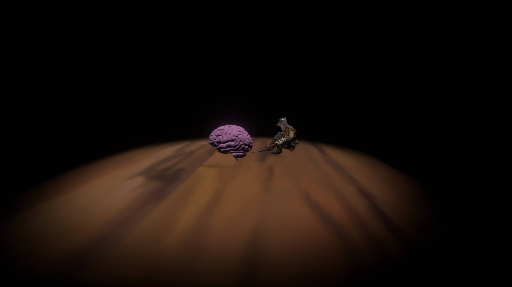

# 

# Mindscapes
Stuck in an eternal time loop, it seems like the only means of escape for the newest member of Outer Wilds Ventures would claim everyone and everything they've ever known as collateral damage. Unless, of course, they were able to convince Slate of the imminent danger. Having already tried just telling them, it may be time to resort to something less conventional. Maybe a Nomai artifact brought back to the observatory could help?

Meant to be a possible prequel to fan content that hinges on the Hearthians escaping from the supernova, such as the mod Evacuation. Note that this mod assumes you have beaten both the main game and the DLC, so you may not want to play it if you haven't completed those yet.

Thank you SanBaiMing for the Chinese translation!
